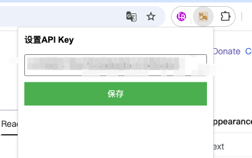
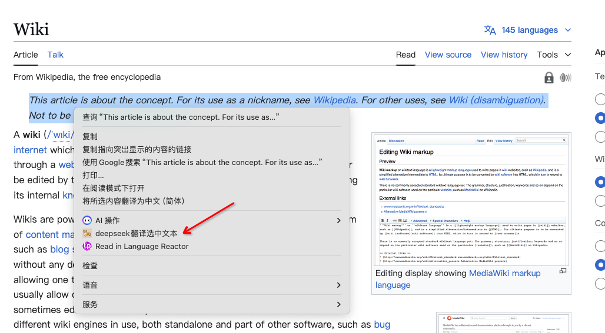
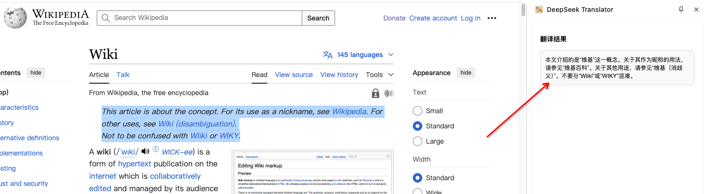

# DeepSeek Translator Chrome Extension

**DeepSeek Translator Chrome Plugin** 是一个 **极简、免费、开源** 的 Chrome 扩展插件，项目完全基于 **DeepSeek 大模型** 生成开发，能够通过右键菜单快速翻译选中的文本，并将结果显示在侧边栏中。与现有插件市场的 AI 翻译插件相比，DeepSeek Translator **无需付费、无需复杂配置**，开箱即用，专注于为用户提供流畅的翻译体验。其翻译效果 **远超传统机翻**，能够更准确地理解上下文，提供自然流畅的翻译结果。
## 功能

- **右键翻译选中的文本**：在网页中选中文本后，右键点击选择“deepseek翻译选中文本”。
- **调用 DeepSeek API 进行翻译**：通过 DeepSeek 的对话接口实现翻译功能。
- **在侧边栏中显示翻译结果**：翻译结果会显示在 Chrome 的侧边栏中。

## 为什么选择 DeepSeek Translator Chrome Plugin？

### 1. **AI 翻译效果卓越**
- 基于先进的 AI 技术，翻译效果 **远远优于传统机翻**。
- 能够理解上下文，提供更自然、更准确的翻译结果。

### 2. **极简设计**
- 无需复杂配置，安装后即可使用。
- 通过右键菜单直接翻译选中的文本，操作简单直观。

### 3. **完全免费**
- 与市场上许多 AI 翻译插件不同，DeepSeek Translator **完全免费**，无需订阅或付费。

### 4. **开源透明**
- 代码完全开源，用户可自由查看、修改和分发。
- 基于 [MIT 许可证](LICENSE)，鼓励社区贡献和改进。

### 5. **轻量高效**
- 专注于核心翻译功能，无冗余功能，占用资源少。
- 翻译结果快速显示在侧边栏，不影响用户浏览网页。

### 6. **隐私保护**
- 仅传输选中的文本进行翻译，不收集用户数据。
- 用户可自行配置 API Key，确保数据安全。

## 安装

### 1. 打开 Chrome 扩展管理页面
- 在 Chrome 浏览器的地址栏中输入 `chrome://extensions/` 并回车。

### 2. 启用开发者模式
- 在扩展管理页面的右上角，找到“开发者模式”开关并打开。

### 3. 加载未打包的扩展程序
- 点击“加载已解压的扩展程序”按钮。
- 在弹出的文件选择窗口中，找到并选择刚刚克隆的仓库目录（`deepseek-translator`）。
- 更多关于加载未打包扩展程序的说明，请参考 [Chrome 官方文档](https://developer.chrome.com/docs/extensions/get-started/tutorial/hello-world?hl=zh-cn#load-unpacked)。

## 功能
- **刷新页面**：点击扩展程序中的柯基图标插件，配置deepseek的API Key

- **右键翻译选中的文本**：在网页中选中文本后，右键点击选择“deepseek翻译选中文本”。

- **调用 DeepSeek API 进行翻译**：通过 DeepSeek 的对话接口实现翻译功能。
- **在侧边栏中显示翻译结果**：翻译结果会显示在 Chrome 的侧边栏中。

## 声明

本人作为前端noob，项目代码利用 **DeepSeek** 花费 **1 天工作时间**（摸鱼开发）完成。由于时间有限，功能、交互和健壮性等方面仍需不断优化。希望大家多多包涵，也欢迎提出宝贵意见和建议！

---

### 后续计划
- 优化翻译结果的显示效果。
- 增强错误处理机制，提高健壮性。
- 支持更多语言翻译。
- API请求耗时较长，需要提供更友好的用户交互体验。

---

### 感谢
- 感谢 **DeepSeek** 提供的强大 AI 翻译能力。

---

如有问题或建议，请联系：
- **GitHub**: [richcorgi](https://github.com/richcorgi)
- **邮箱**: zhou273409029@gmail.com
